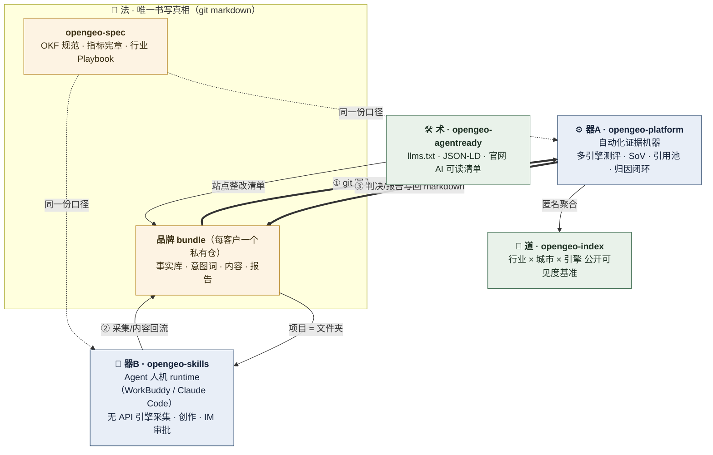

## cangqiaoGEO · OpenGEO 开源组织

**GEO（生成式引擎优化）的开放标准与开源工具层** —— 让任何企业都能「看见、理解、验证」自己在 AI 里的存在。闭源 SaaS 把「看见」卖 399 美元/月，OpenGEO 把「看见」变成公共品。

### 一套架构：法只写一遍，两个 runtime，一个遥测库

**单向环流**：① 知识只在 git 里写 → ② platform 导入计算（遥测只在数据库里算）→ ③ 判决以 markdown 写回 bundle。每个存储只对自己的领域有写权——没有双向同步，因此没有冲突。

| 角色 | 仓库 | 一句话 |
| --- | --- | --- |
| 门户 | [OpenGEO](https://github.com/cangqiaoGEO/OpenGEO) | 初衷、口径宪章、详解教程、治理 |
| 法 | [opengeo-spec](https://github.com/cangqiaoGEO/opengeo-spec) | OKF 事实规范 · [Bundle 目录规范](https://github.com/cangqiaoGEO/opengeo-spec/blob/main/BUNDLE.md) · [指标宪章](https://github.com/cangqiaoGEO/opengeo-spec/blob/main/METRICS.md) · [行业 Playbook](https://github.com/cangqiaoGEO/opengeo-spec/tree/main/playbooks) |
| 器 · 自动化 | [opengeo-platform](https://github.com/cangqiaoGEO/opengeo-platform) | 证据机器：多引擎测评、SoV、引用池、Studio 内容流水线、归因闭环 |
| 器 · Agent | [opengeo-skills](https://github.com/cangqiaoGEO/opengeo-skills) | 七技全量（S1 诊断 → S7 周测）+ 总控 Agent + WorkBuddy 官方实现 |
| 术 | [opengeo-agentready](https://github.com/cangqiaoGEO/opengeo-agentready) | llms.txt / JSON-LD / 官网 AI 可读清单与 S6 建站技能 |
| 道 | [opengeo-index](https://github.com/cangqiaoGEO/opengeo-index) | **OpenGEO Index**：行业 × 城市 × 引擎公开可见度基准 |

**口径宪章**：不承诺排名第一 · 不承诺被所有 AI 推荐 · 不承诺统一见效天数；只承诺诊断分数 · 改进清单 · 复测对比。违背者的 PR 直接关闭。

📖 在线教程：https://cangqiaogeo.github.io/OpenGEO/course/ ｜ 治理与 RFC：[GOVERNANCE.md](https://github.com/cangqiaoGEO/OpenGEO/blob/main/GOVERNANCE.md) ｜ 发起方：杭州仓桥智能科技

> 2026-08-28 重构（v2）：原 L0–L5 六层收敛为「法 / 器 / 术 / 道」四角色；opengeo-audit 与 opengeo-insights 已并入上表各仓（六维口径升格为指标宪章，S1/S2/S7 入 skills，S6 入 agentready，采集器入 platform）。
